# Best Bottles - Visual Product Fitment Matrix

Here is the architectural overview mapping our key bottle styles to their entire ecosystem of compatible components.

## Component Compatibility Matrix

| Bottle Type | Exact Thread Size | Compatible Caps | Compatible Sprayers | Compatible Droppers | Roll-On Caps | **Total Compatible Components** |
| :--- | :---: | :---: | :---: | :---: | :---: | :---: |
| **Cylinder 25ml** | `18-415` | 12 | 23 | 3 | 0 | **91** |
| **Circle 100ml** | `18-415` | 12 | 23 | 3 | 0 | **91** |
| **Roll-On 5ml** | `13-415` | 0 | 0 | 0 | 11 | **11** |

---

## Visual Architecture (Mermaid Chart)
*You can view this diagram in any Markdown viewer that supports Mermaid (like GitHub, Notion, or VS Code).*

```mermaid
mindmap
  root((Best Bottles<br/>Product Ecosystem))
    Standard Neck Bottles
      [18-415 Thread]
        Cylinder 25ml
        Circle 100ml
        ::icon(fas fa-flask)
        (Compatible Fitments 👇)
          Caps & Closures
            12 SKU Options
            Colors: Black, Silver, Gold, Copper, Pink...
          Fine Mist Sprayers
            23 SKU Options
            Styles: Standard, Antique Bulb w/ Tassels
          Glass Droppers
            3 SKU Options
            Bulbs: Silicon, Rubber, Metallic finishes
    Roll-On Bottles
      [13-415 Thread]
        Roll-On 5ml
        ::icon(fas fa-prescription-bottle)
        (Compatible Fitments 👇)
          Roll-On Caps & Plugs
            11 SKU Options
            Styles: Matte Silver, Shiny Gold, Dotted Black...
```

```mermaid
graph LR
    subgraph Bottles ["🍾 BOTTLE FAMILIES"]
        B1["Cylinder 25ml<br/>(18-415)"]
        B2["Circle 100ml<br/>(18-415)"]
        B3["Roll-On 5ml<br/>(13-415)"]
    end

    subgraph Standard18415 ["🟢 18-415 STANDARD FITMENTS"]
        F1["Caps / Closures<br/>(12 Variants)"]
        F2["Sprayers<br/>(23 Variants)"]
        F3["Droppers<br/>(3 Variants)"]
    end

    subgraph Rollon13415 ["🟣 13-415 ROLL-ON FITMENTS"]
        F4["Roll-On Caps<br/>(11 Variants)"]
    end

    B1 ---|Matches| Standard18415
    B2 ---|Matches| Standard18415
    B3 ---|Matches| Rollon13415
    
    style B1 fill:#f9f9f9,stroke:#333,stroke-width:2px
    style B2 fill:#f9f9f9,stroke:#333,stroke-width:2px
    style B3 fill:#e6f3ff,stroke:#0066cc,stroke-width:2px
    style Standard18415 fill:#e8f5e9,stroke:#2e7d32
    style Rollon13415 fill:#f3e5f5,stroke:#7b1fa2
```

